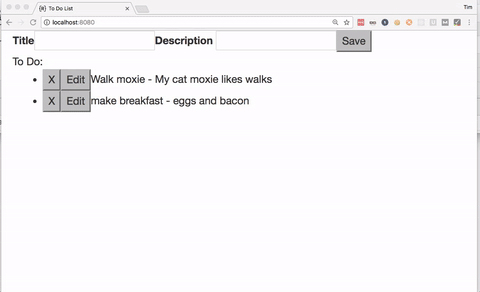

# Todo in React

A todo app in react.  Be warned, there is no styling at the moment.

## Setup

In the terminal, run:

```
npm install
```

Build and serve the app with:

```
webpack-dev-server
```

Open the app in your browser:

```
open http://localhost:8080
```

## Demo

